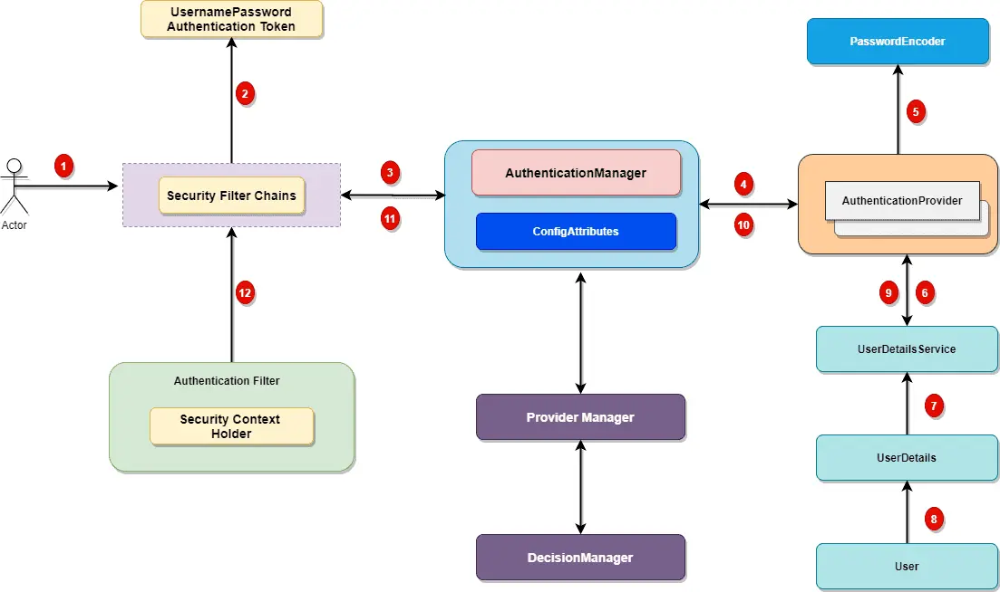

## Câu 1
* UserNamePasswordAuthenticationToken: Là một lớp trong Spring Security framework của Java được sử dụng để xác thực người dùng bằng cách yêu cầu tên đăng nhập và mật khẩu. Lớp này đại diện cho một yêu cầu xác thực người dùng và bao gồm thông tin về tên đăng nhập và mật khẩu cùng với các thông tin xác thực khác, chẳng hạn như một danh sách các quyền hoặc vai trò người dùng.
* AuthenticationManager là một giao diện (interface) trong Spring Security framework của Java, định nghĩa phương thức để xác thực một yêu cầu đăng nhập từ người dùng. Nó là một phần quan trọng của quá trình xác thực và cung cấp một phương thức để thực hiện việc xác thực và trả về một đối tượng Authentication. Phương thức chính của AuthenticationManager là authenticate(Authentication authentication), nó được sử dụng để xác thực yêu cầu đăng nhập. Đối số truyền vào là một đối tượng Authentication, chứa thông tin về người dùng, bao gồm tên đăng nhập và mật khẩu. AuthenticationManager sẽ sử dụng một hoặc nhiều đối tượng AuthenticationProvider để thực hiện việc xác thực. AuthenticationProvider cung cấp một phương thức để kiểm tra tính hợp lệ của thông tin đăng nhập, thông qua cơ chế mã hóa và so sánh với thông tin trong cơ sở dữ liệu hoặc bất kỳ nguồn dữ liệu nào khác mà ứng dụng đang sử dụng. Khi quá trình xác thực được hoàn thành thành công, AuthenticationManager trả về một đối tượng Authentication đã được chứng thực. Nếu quá trình xác thực không thành công, AuthenticationManager sẽ ném ra một ngoại lệ (exception) để báo cho ứng dụng biết rằng việc đăng nhập không thành công.
* AuthenticationProvider là một interface trong Spring Security framework của Java, định nghĩa phương thức để xác thực yêu cầu đăng nhập từ người dùng. AuthenticationProvider là một phần quan trọng của quá trình xác thực trong Spring Security. Phương thức chính của AuthenticationProvider là authenticate(Authentication authentication), nhận đối tượng Authentication chứa thông tin về người dùng cần được xác thực và thực hiện việc xác thực. Nếu xác thực thành công, nó sẽ trả về một đối tượng Authentication mới với thông tin xác thực của người dùng. Nếu không thành công, nó sẽ ném ra một ngoại lệ (exception) để báo cho hệ thống biết rằng việc xác thực thất bại.
* PasswordEncoder là một interface trong Spring Security framework của Java, định nghĩa phương thức để mã hóa mật khẩu người dùng thành một giá trị băm (hash value) an toàn.
  Spring Security cung cấp một số lớp implements của PasswordEncoder như sau:
  * BCryptPasswordEncoder: mã hóa mật khẩu sử dụng thuật toán bcrypt, được coi là một trong những thuật toán mã hóa mật khẩu mạnh nhất.

  * Pbkdf2PasswordEncoder: mã hóa mật khẩu sử dụng thuật toán PBKDF2, được xem là một trong những thuật toán mã hóa mật khẩu mạnh nhất.

  * SCryptPasswordEncoder: mã hóa mật khẩu sử dụng thuật toán SCrypt, tương tự như bcrypt và PBKDF2, được coi là một trong những thuật toán mã hóa mật khẩu mạnh nhất.

  * NoOpPasswordEncoder: không mã hóa mật khẩu, sử dụng trong các trường hợp kiểm tra mật khẩu tạm thời hoặc môi trường phát triển để tắt tính năng mã hóa mật khẩu.
* UserDetailsService là một interface trong Spring Security framework của Java, định nghĩa phương thức để tìm kiếm thông tin người dùng từ cơ sở dữ liệu hoặc bất kỳ nguồn dữ liệu nào khác để sử dụng trong quá trình xác thực. UserDetailsService là một phần quan trọng của quá trình xác thực trong Spring Security.
Phương thức chính của UserDetailsService là loadUserByUsername(String username), nhận tên đăng nhập của người dùng và trả về một đối tượng UserDetails. Đối tượng UserDetails chứa thông tin về người dùng, bao gồm tên đăng nhập, mật khẩu được mã hóa, vai trò (roles) và các thuộc tính khác của người dùng.
* UserDetails là một interface trong Spring Security framework của Java, định nghĩa phương thức để lấy thông tin chi tiết của một người dùng trong quá trình xác thực. UserDetails được sử dụng để biểu diễn thông tin chi tiết của một người dùng như tên đăng nhập, mật khẩu được mã hóa, vai trò và các thuộc tính khác.
UserDetails cung cấp các phương thức để lấy thông tin về người dùng, bao gồm:

  * getUsername(): trả về tên đăng nhập của người dùng.

  * getPassword(): trả về mật khẩu được mã hóa của người dùng.

  * getAuthorities(): trả về danh sách các vai trò của người dùng.

  * isEnabled(): trả về trạng thái của người dùng, ví dụ: có được kích hoạt hay không.

  * isAccountNonExpired(): trả về trạng thái của tài khoản người dùng, ví dụ: có hết hạn hay không.

  * isAccountNonLocked(): trả về trạng thái của tài khoản người dùng, ví dụ: có bị khóa hay không.

  * isCredentialsNonExpired(): trả về trạng thái của thông tin đăng nhập người dùng, ví dụ: có hết hạn hay không.
## Câu 2:
Spring Security là một framework trong Java, cung cấp các tính năng bảo mật và xác thực trong ứng dụng web. Workflow của Spring Security bao gồm các bước chính sau đây:

1. Yêu cầu xác thực: khi một người dùng truy cập vào một phần của ứng dụng mà yêu cầu xác thực, Spring Security sẽ chuyển hướng người dùng đến trang đăng nhập.

2. Xác thực người dùng: sau khi người dùng nhập thông tin đăng nhập, Spring Security sẽ kiểm tra thông tin này với các thông tin được lưu trữ trong cơ sở dữ liệu hoặc bất kỳ nguồn dữ liệu nào khác, sử dụng các implement của AuthenticationProvider để xác thực người dùng.

3. Tạo đối tượng Authentication: nếu thông tin đăng nhập hợp lệ, Spring Security sẽ tạo ra một đối tượng Authentication để biểu diễn thông tin về người dùng đã xác thực.

4. Lưu trữ đối tượng Authentication: đối tượng Authentication sẽ được lưu trữ trong SecurityContextHolder, một class static để quản lý thông tin bảo mật trong ứng dụng.

5. Phân quyền: Spring Security sử dụng đối tượng Authentication để kiểm tra vai trò của người dùng và xác định quyền truy cập của họ đến các tài nguyên trong ứng dụng.

6. Kiểm tra quyền truy cập: khi một người dùng cố gắng truy cập một tài nguyên, Spring Security sẽ kiểm tra đối tượng Authentication để xác định xem người dùng có được phép truy cập hay không.

7. Xử lý các ngoại lệ bảo mật: nếu người dùng không được phép truy cập, hoặc nếu có các lỗi bảo mật khác xảy ra, Spring Security sẽ xử lý các ngoại lệ bảo mật và chuyển hướng người dùng đến một trang lỗi hoặc một trang xác thực khác.

## Câu 3
Session và Cookie là hai khái niệm trong lập trình web, được sử dụng để lưu trữ thông tin trên trình duyệt của người dùng. Tuy nhiên, chúng có các khác biệt quan trọng như sau:

1. Session:
* Session là một kỹ thuật trong lập trình web để lưu trữ thông tin trên server. Khi một người dùng truy cập vào trang web, một phiên làm việc mới sẽ được tạo ra trên server, và các thông tin liên quan đến phiên đó sẽ được lưu trữ trong bộ nhớ trên server. Mỗi phiên đều có một ID duy nhất được sinh ra để xác định phiên làm việc đó.
* Session thường được sử dụng để lưu trữ thông tin quan trọng, như thông tin đăng nhập của người dùng hoặc giỏ hàng trong trang mua sắm.
2. Cookie:
* Cookie là một tập tin nhỏ được lưu trữ trên trình duyệt của người dùng. Cookie được sinh ra từ server và được gửi đến trình duyệt của người dùng, sau đó được lưu trữ trên trình duyệt. Khi người dùng truy cập lại trang web, cookie sẽ được gửi lại đến server để nhận dạng người dùng.
* Cookie thường được sử dụng để lưu trữ thông tin nhẹ, như thông tin ngôn ngữ hoặc thời gian tồn tại của phiên làm việc.
3. Sự khác biệt giữa session và cookie:

* Session được lưu trữ trên server, trong khi cookie được lưu trữ trên trình duyệt của người dùng.
* Session có thể lưu trữ nhiều thông tin khác nhau, trong khi cookie chỉ có thể lưu trữ một số thông tin nhỏ.
* Session thường được sử dụng để lưu trữ thông tin quan trọng hơn, trong khi cookie thường được sử dụng để lưu trữ thông tin nhẹ hơn.
* Session có thời gian sống tùy thuộc vào cấu hình trên server, trong khi cookie có thời gian sống được xác định trước và được lưu trữ trên trình duyệt của người dùng.